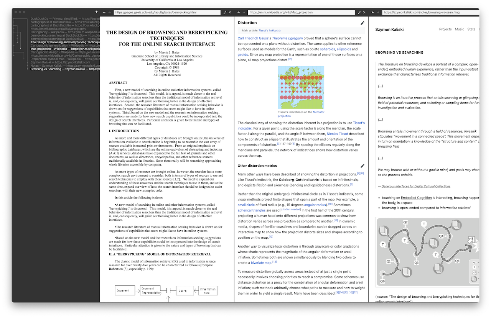

# Cartographist

Cartographist is an experimental web browser optimized for rabbit-holing.

- Instead of opening new windows, Cartographist spawns horizontally-scrollable panes.
- Instead of finding things in a linear history, Cartographist shows a tree-structured outline of your browsing.
- Instead of not persisting anything (or persisting only the current set of tabs), Cartographist can save and load "trails" (to/from disk), the exact state of the session you've left (supporting researching topics over long periods of time).

## Running

1. `npm install`
2. `npm start`

No binary builds are available right now, purely out of laziness.

